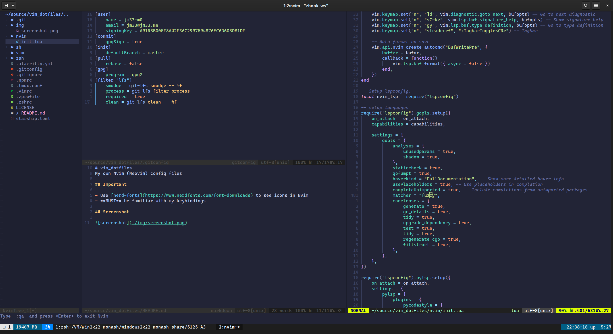

# vim_dotfiles
my (neo)vim config files

## important

- please use [nerd-fonts](https://www.nerdfonts.com/font-downloads) if you want to see icons in nvim
- **Read before using**, you need to be familiar with my keybindings

## features

- golang, python, c, bash, markdown and more
- `./nvim/install.sh` script

