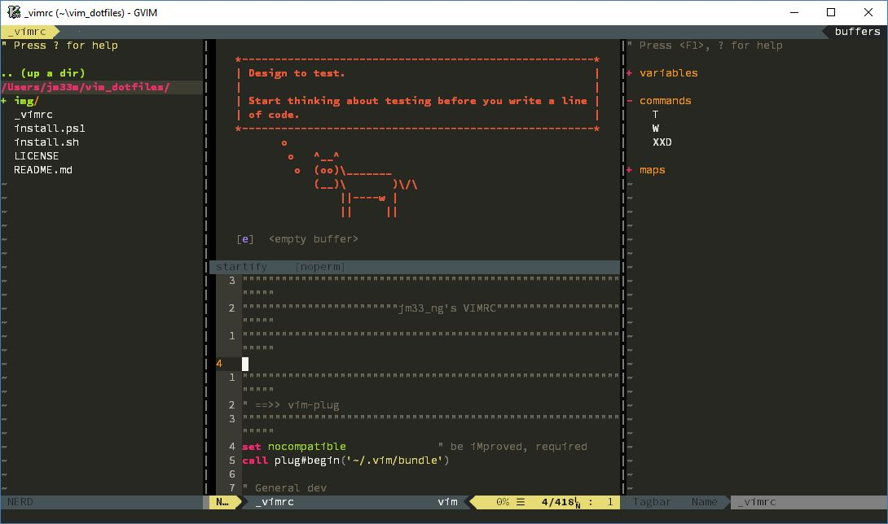

# vim_dotfiles
my vim config files

## important

- please use [powerline-fonts](https://github.com/powerline/fonts) for special characters rendering
- make sure you have read the `vimrc` code before installing it, 'coz there're some dependencies that you have to be aware of
- **Read vimrc before using**, you need to be familiar with my keybindings
- works fine for Windows, Linux and MacOS

## language specific

### python virtualenv

- run `virtualenv .venv` under project root, ALE will choose your python automatically (dont forget to run `/path/to/python -m pip install pylint` too

- for YCM

A common practice when working on a Python project is to install its dependencies in a virtual environment and develop the project inside that environment. To support this, YCM needs to know the interpreter path of the virtual environment. You can specify it by creating a .ycm_extra_conf.py file at the root of your project with the following contents:

```
def Settings( **kwargs ):
  return {
    'interpreter_path': '/path/to/virtual/environment/python'
  }
```

where /path/to/virtual/environment/python is the path to the Python used by the virtual environment you are working in. Typically, the executable can be found in the Scripts folder of the virtual environment directory on Windows and in the bin folder on other platforms.

### c/cpp

- use `:YcmGenerateConfig` in your project, to enable autocompletion and other features provided by YCM (requires `Makefile`), check [YCM's doc](https://valloric.github.io/YouCompleteMe/#c-family-semantic-completion) for details
- use [gutentags_plus](https://github.com/skywind3000/gutentags_plus) for code navigation

## features

- IDE-like dev environ for Python, Go, etc.
- installs plugins automatically using [vim-plug](https://github.com/junegunn/vim-plug)
- must-have plugins to satisfy your daily needs
- customizable keyboard shortcuts


